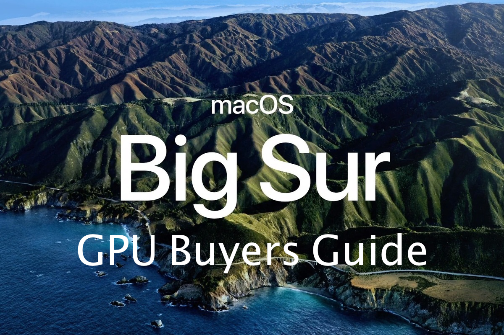

# Introduction

So it's that time of year again, a new version of macOS has been released and the age-old question will be asked once again:

**What GPUs are supported with macOS 11 Big Sur?**

Well you've come to the right place, I'll give a quick rundown on the situation and go into more detail on exact GPUs we recommend.

## A quick refresher with Nvidia and WebDrivers

Well currently as of the time of writing, we've gone a full OS cycle without official drivers from Nvidia for their Maxwell, Pascal or Turing GPUs. What this means is that users of these GPUs have no support for Mojave, Catalina or Big Sur so are stuck with macOS 10.13 High Sierra. Who's to blame? Well it's 2 giant, egotistical companies who both refuse to work together so the blame can go both ways. Do keep in mind that the WebDrivers have a VRAM leakage issue that they've yet to address, so a theory to why Apple refuses Nvidia drivers in macOS may be due to how Nvidia refuses to hand over the driver stack. Think it's a coincidence that both AMD and Intel have open-sourced drivers? Well, either wa/y, it doesn't change the fact there's no support.

Users with Kepler based GPUs are in the clear though, they utilize Apple's native drivers

And for those who want some reading to do: [When will the Nvidia Web Drivers be released for macOS Mojave 10.14 ](https://devtalk.nvidia.com/default/topic/1042520/drivers/-when-will-the-nvidia-web-drivers-be-released-for-macos-mojave-10-14-/post/5358999/#5358999)

Great read as it shows how even upper management doesn't have a good answer for customers

## So if my GPU is natively supported, why do i need Lilu and WhateverGreen?

This is a question comes up quite a bit in the Hackintosh community, and for good reason as to why in the world would these GPUs work out of the box on a mac and not a Hackintosh? Well, the reason being is that PCs and Macs have different internal wiring and so the ACPI layouts in a PC don't work well with Macs in different scenarios. To get around this, we use [WhateverGreen](https://github.com/acidanthera/WhateverGreen/releases) and it's companion [Lilu](https://github.com/acidanthera/Lilu/releases) to patch different parts of our Hackintosh like renaming devices, assisting in framebuffer connections, patching audio connectors, allowing modifications to aty\_config, aty\_properties, cail\_properties via ACPI and so much more. With such a large feature set and developed by someone who knows what they're doing, there's no reason not to use it

## So what are my options?

So there’s still 2 routes for discrete GPUs you can go, either AMD or Nvidia(Yes, there’s actually natively supported Nvidia cards in Catalina). So I’ll be going over what GPUs are compatible and what features/drawbacks they hold.

Things to remember:

* macOS does not support either SLI, Crossfire or GPUs will multiple main cores(like the Radeon Pro Duo). This may change with the release of the Radeon Pro Vega II Duo in the Mac Pro
* Getting audio through HDMI/DisplayPort may require extra work with both AppleALC.kext and some other IO-REG edits
* GPU Overclocking is limited to Vega 10 GPUs with [PyVega](https://github.com/corpnewt/PyVega)
* Running supported GPUs alongside unsupported GPUs can have weird consequences as unsupported GPUs run off VESA drivers which have the issue in which it can break sleep and other functions in macOS. Please refer to the [Disabling unsupported GPUs Guide](https://dortania.github.io/OpenCore-Install-Guide/extras/spoof.html) for more info

## Can I run an unsupported GPU in my hack?

So something to keep in mind when running an unsupported GPU in macOS is will fall back on VESA drivers when no real drivers are present. These are very simple, CPU based drivers that are used as a stop-gap while you wait to install the correct drivers but many basic functions of macOS are broken when running this way including sleep and general stability. And since these GPUs have no drivers even outside of Apple, we need some way to stop the unsupported GPU from being recognized in macOS. So what do we do? Well I'm glad you ask. With my patent pending [How to disable your unsupported GPU for macOS Guide](https://dortania.github.io/OpenCore-Install-Guide/extras/spoof.html), even a simpleton like you can experience the glories of Mojave and beyond!

> But can I render macOS on my iGPU but use the video outs on my unsupported GPU?

Unfortunately not, and the reason being is actually quite similar to how Nvidia's Optimus technology functions. You would first need a way to grab/encode the iGPU's signal, send it towards the discrete GPU, then have said GPU decode the signal and display it. One small problem, decoding the signal would require proper GPU acceleration which your unsupported GPU doesn't have. So you will need to use your motherboard's video out ports no matter what

